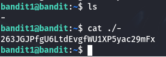

# Finding pwd to level 2
In this level I needed to find the password stored in the file called "-" in home directory.

To accomplish this task, I needed to list the files in the home directory. To do this, I used the ls command. After confirming the existence of the - file I can display its contents using the cat ./- command.
The use of ./ ensures that - is explicitly treated as a filename, avoiding it being interpreted as a special argument.

