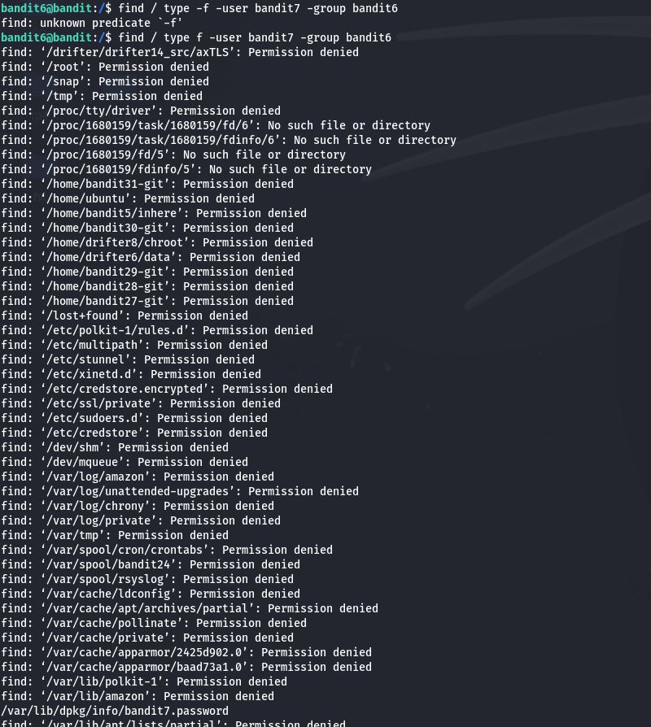
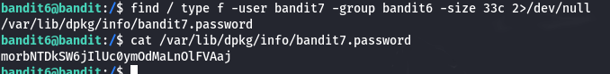

The information provided to us was that the password is located in a file with the following attributes:

Owner Group: bandit6
Owner User: bandit7
Size: 33 bytes
After performing ls, ls -a, and ls -a -l as instructed, we couldn’t find a file matching these specifications. We decided to navigate to higher directories using cd .. to broaden our search.

Next, I used the find command with the -group and -user filters, since the file's owner and group were already known. While we could have also used the -size filter, we assumed the file would be easy to locate based on just these two parameters at this level.

After reviewing the search results, I found the file among several errors. However, I continued to explore additional commands that could help eliminate these error messages and ultimately found the solution.

