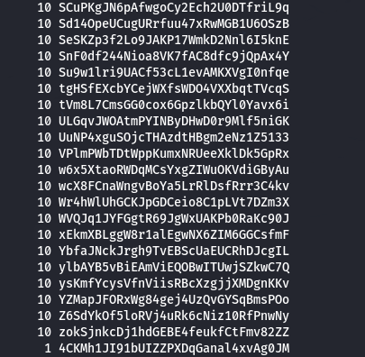

# Finding password to level 9

Continuing with the same type of exercise as in Level 7, I was told to find a password in a file. The password was the only line that occurred only once.

To accomplish this, I decided to count the occurrences of each line. Using sort and uniq, I was able to easily identify it by printing the file with the number of repetitions for each line. Sorting the output placed the solution at the bottom.

The command I used was:
sort data.txt | uniq -c | sort

