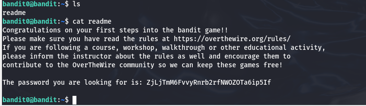

# Level 1
In this level we need to find the password stored in a file in home directory

To do this we just need to do list the files in home directy which we already are on. To do this we do the "ls" command and after seing only the readme file we will print it with "cat readme" command.

