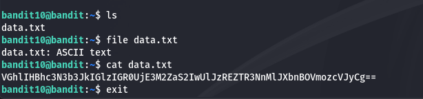
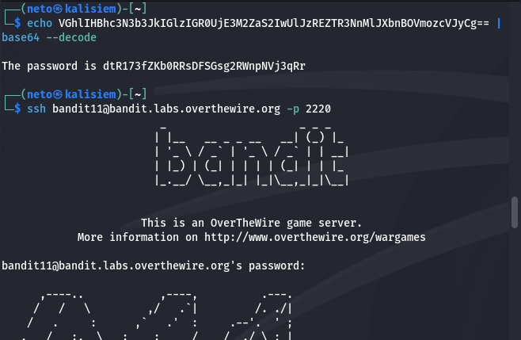

# Finding Flag for Level 11

In this level, the task was straightforward: the flag was stored in a file named `data.txt`, but it was encoded in **Base64**.

## Steps to Solve:

1. **Read the contents of `data.txt`:**  
   Using the classic `cat` command, I displayed the encoded message:

   ```bash
   cat data.txt

   This showed a long Base64-encoded string spanning the entire file.



2. **Decode the string:**

To decode the string, I used the Linux base64 command with the --decode on the given string and printed it on termianl with the echo command. Here's the command:

    ```bash
    echo "string" | base64 --decode

