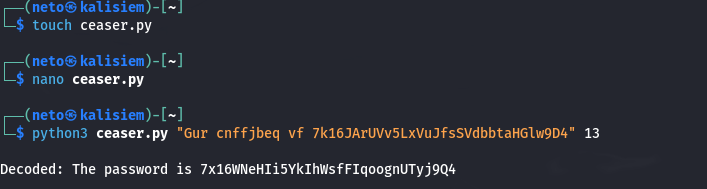
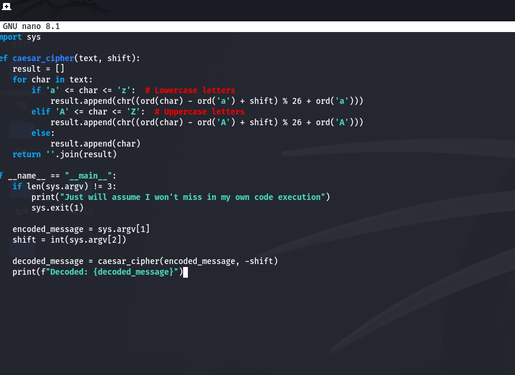

# Finding flag for level 12

In this exercise I had again the flag in a data.txt but this time it each character was rotated 13 times.

1. **Getting encoded string:**

    Even tho I know there is ways to do it directly in the linux terminal I took the chance to use python to take the rusty off. Getting first the encoded message with:
    
    `cat data.txt`

2. **Making the Script and getting the flag:**

    After having the encoded message I created a small python script in my machine that makes ceaser decryption given a certain message and certain shift. Results shown in the figures

