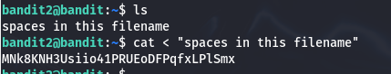

# Finding pwd to level 3

The process is the same as in Levels 0 and 1. We need to find the password in a file named "spaces in this filename", located in the home directory. To do this, we repeat the process but enclose the file name in quotation marks (" ") to ensure it is treated as a single argument.

