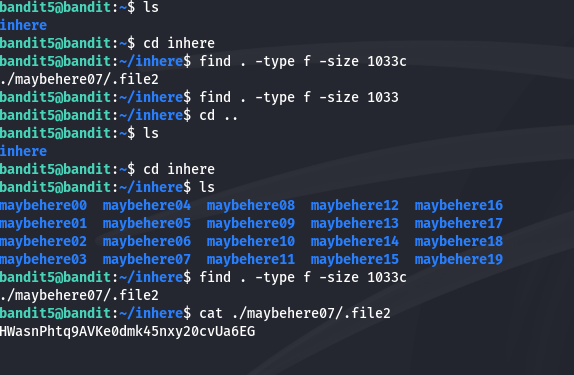

# Finding the Password for Level 6

The password is stored in a file somewhere under the inhere directory. The file has the following properties: it is human-readable, 1033 bytes in size, and not executable.

To locate it, we first navigate to the inhere directory with cd inhere. Then after using ls and seing many directories, we use the find command:

find . -type f -size 1033c

This was to filter the 1033 bytes size files in the current directory and every sub-directory and fortunatly there was one.

Once the correct file is identified, we use cat path\<filename> to display its content and retrieve the password for the next level.

HWasnPhtq9AVKe0dmk45nxy20cvUa6EG
