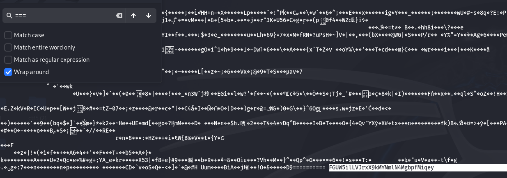

# Finding flag to level 10

In this level I needed to find the human-readble password in a binary file.

Knowing the password was after a few "=" symbols i just used the search feature on the cmd.

